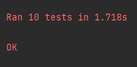

[](https://github.com/leonardosblang/car_api/actions/workflows/python-app.yml)

# Python FastAPI - CarRUD

API e testes unitários de uma api de carros;

## Instação e rodar

Instalar dependências

```bash
pip install fastapi
pip install uvicorn[standard]
pip install pymongo
pip install dnspython
```

Rodar API

```bash
uvicorn main:app
```
<p align="center">
  
</p>

Rodar Testes

```bash
python -m unittest
```
